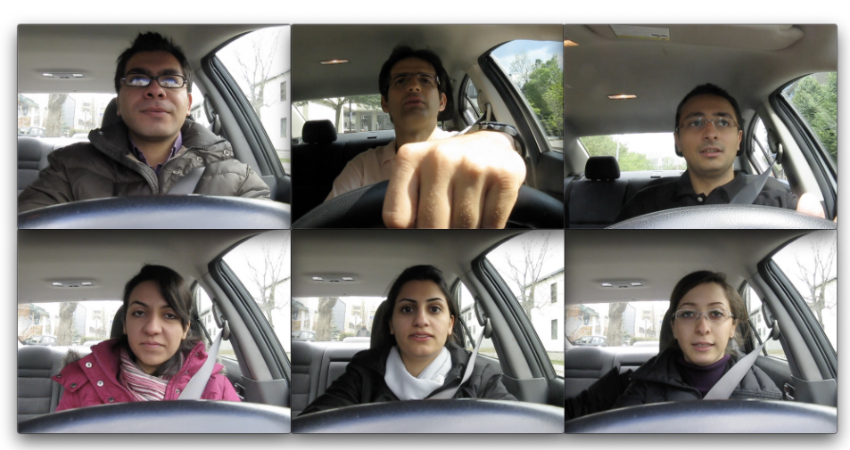
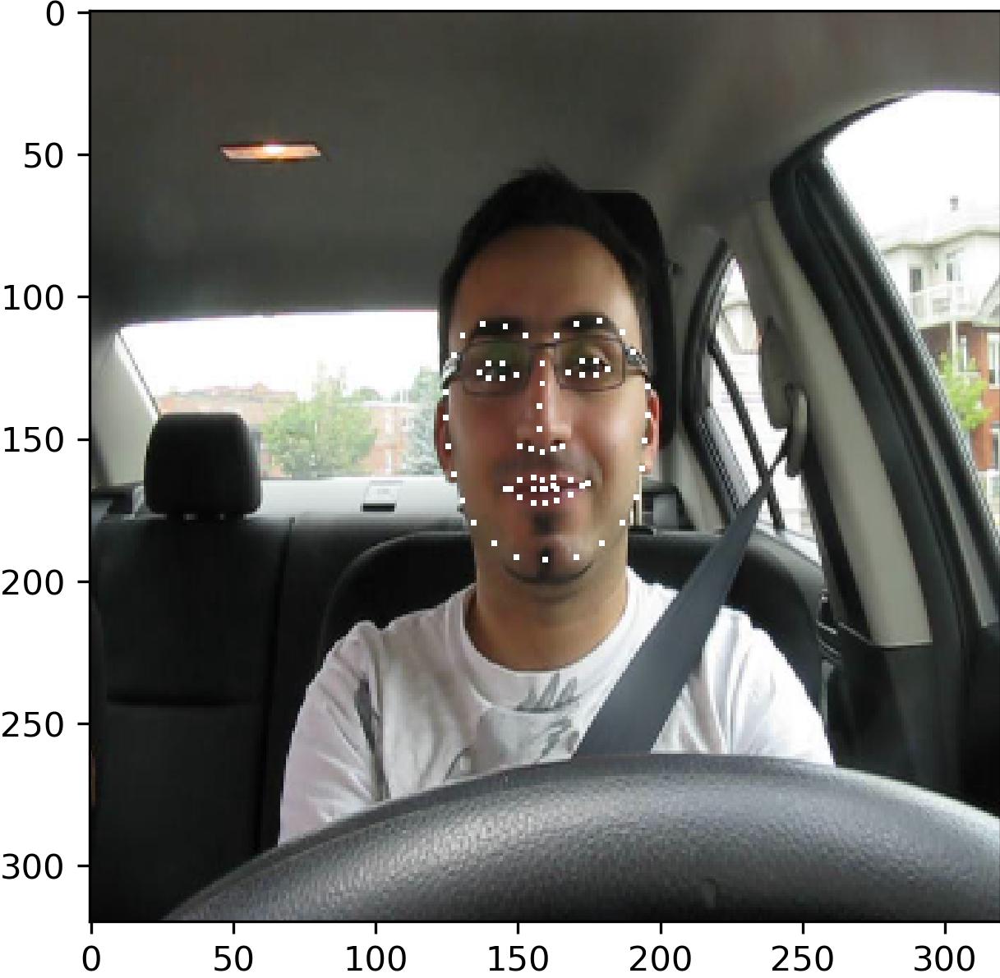
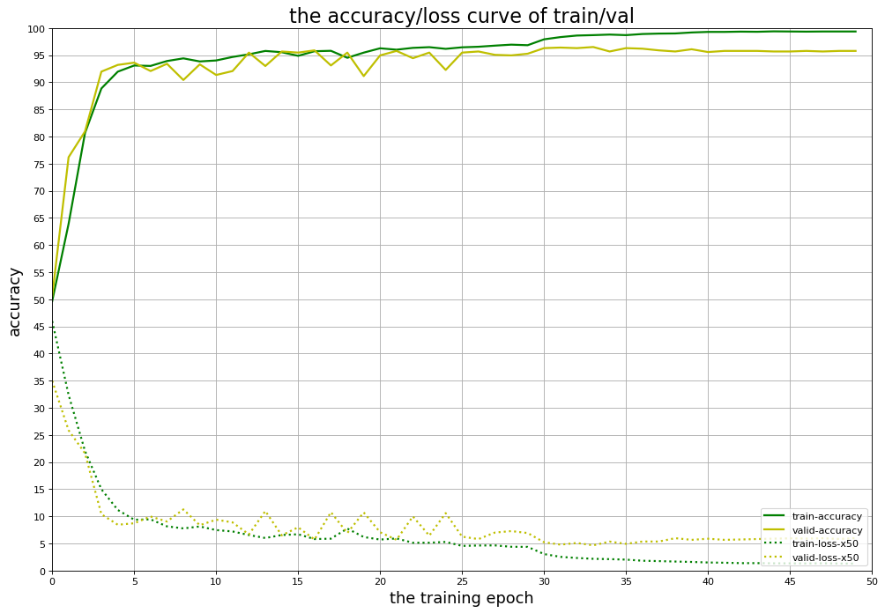

# EEE511 Final Project: Team 03
**Final project of EEE 511 Final project (Spring 2020)**

**Major reference:** *Somnolence Detection System Utilizing Deep NeuralNetwork*

```latex
@inproceedings{villanueva2019somnolence,
  title={Somnolence Detection System Utilizing Deep Neural Network},
  author={Villanueva, Alonica and Benemerito, Renzo Leru L and Cabug-Os, Mark Jetro M and Chua, Royce B and Rebeca, Cyrille Kristein DC and Miranda, Menchie},
  booktitle={2019 International Conference on Information and Communications Technology (ICOIACT)},
  pages={602--607},
  year={2019},
  organization={IEEE}
}
```


## Drowsiness Detection Utilizing Deep Neural Network

The objective of this detect the drowsiness based on the behavioral information from the drivers. We are using multiple behavior features including eye closure and yawning. 



- Yawning dataset: [YawnDD](http://www.site.uottawa.ca/~shervin/yawning/)
- Eye closure dataset: [CEW](http://parnec.nuaa.edu.cn/xtan/data/ClosedEyeDatabases.html)

The details of the project has been summarized into the [slides of the final presentation](https://docs.google.com/presentation/d/1MrKvRLfknxsxRxQ4_F_JIcR_-DiOV8DrOQTNNWUVnHA/edit?usp=sharing). 

------

## Data pre-processing

Since the YawnDD dataset is a video dataset, therefore to detect the drowsiness with CNN, we need to extract the frames first and also convert it to proper sizes. Moreover, in order to train the Convolutional Neural Network model, it is also necessary to use frames to construct the dataset for training and testing. 

To test the preprocessing of the video, please run `preprocess.py` inside `yawning_dataset` folder. The dataset of yawning detection can also be generated from the `preprocess.py`. All the sample videos that we used are packed into  `yawning_dataset/videos`(not accessible on github, please use the submitted final package to run). 

To run `preprocess.py`, copy this to your terminal:

```python
python preprocess.py
```

The openess of the mouth has been measured based on the Euclidian distance between the top lip and the bottom lip. Before measuring the lip distance, the code will generate the facial landmarks to locate the mouth and eyes:



Then the detection algorithm will measure the average euclidian distance between the top lip and the bottom lip. If the distance is higher than a certain threshold (we emperically found is 15), then the mouths will be labeled as "Yawning". To remove the interference of other objectives in each frame, the final dataset will only included mouth that cropped from the frame (based on the landmarks).


The final dataset was extracted from 6 different videos of YawnDD dataset, it included 13212 images for both male and female. Due to the large size of the dataset, it cannot be directly access on GitHub, the entire dataset has been packed into the submission folder.

## Neural Network Training

The CNN model that we used for this detection project is SqueezeNet that proposed by the research group from MIT. With the advantange of compact structure, our observation shows the fact that the model can reach 7.4 epoch / sec with single Nvidia RTX-2080Ti GPU. Here's the verification reuslts of the model that we performed in order to verify the basline performance: 

- With ImageNet 1k dataset:

|          Methods           | Top@1 Test accuracy | Top @5 Test accuracy |
| :------------------------: | :-----------------: | -------------------- |
|    SqueezeNet (Team 03)    |       56.7 %        | 80.9%                |
| SqueezeNet (Paper results) |        57.5%        | 81.5%                |
|             LR             |        1e-4         | 1e-4                 |

- With CIFAR10 dataset:

|       Methods        | Top@1 Test accuracy |
| :------------------: | :-----------------: |
| SqueezeNet (Team 03) |       85.60 %       |

To run the CIFAR10 training, please copy the following command to your terminal:

```python
bash train_fp_cifar.sh
```

------

We trained two different models for both Yawning detection and Eye closure detection. Regarding the Yawning detection, due to the sufficient amount of data samples and relatively over-sized model, the network can reach 99.9 % Top1 test accuracy in only 10 epochs.

|       Methods        |     Dataset      | Top@1 Test accuracy |
| :------------------: | :--------------: | :-----------------: |
| SqueezeNet (Team 03) | Extracted YawnDD |       99.9 %        |

Here's the training details:

- Learning rate: 0.01
- Batchsize = 64
- Training epoch = 10
- Weight decay = 0.0001

To run the YawnDD training, pleas copy the following command to your terminal:

```python
bash train_fp_yawnDD.sh
```


------

With the open source eye closure dataset, we can reach 96.5 % Top 1 test accuracy with 50 epochs training

|       Methods        |       Dataset       | Top@1 Test Accuracy | Top@5 Test Accuracy |
| :------------------: | :-----------------: | :-----------------: | ------------------- |
| SqueezeNet (Team 03) | Eye closure dataset |       96.5 %        | 100.0 %             |

Here's the training details:

- Learning rate: 0.01, down scaled by 0.1 at Epcoh 30 & 40
- Batchsize = 32
- Training epoch = 50
- Weight decay = 0.0001

The following curve shows the training process of the eyeclosure detection



To run the eye closure training, pleas copy the following command to your terminal:

```python
bash train_fp_eyeclosure.sh
```

**The reuslts of training can testing can be found in ** `results` **folder**.

------

## Requirements

```python
python 3.7.4
pytorch 1.2.0
numpy 1.17.4
dlib 19.19.0
opencv 4.2.0
```

